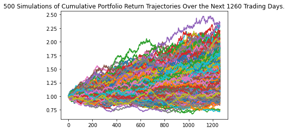

# Unit 5 - Financial Planning

## Background

My FinTech consultancy firm, offers the tools that helps my members enhance their financial health in the following planners: 

1. Personal finance planner that will allow users to visualize their savings composed by investments in shares and cryptocurrencies to assess if they have enough money as an emergency fund.

2. The second tool will be a retirement planning tool that will use the Alpaca API to fetch historical closing prices for a retirement portfolio composed of stocks and bonds, then run Monte Carlo simulations to project the portfolio performance at 30 years. You will then use the Monte Carlo data to calculate the expected portfolio returns given a specific initial investment amount.

### Personal Finance Planner
| Cryptos & Stock Values | Amount |
| --- | --- |
| Crypto Value   | $18,012.975 | 
| Stocks Value   | 40,486.50   | 
| TOTAL      |   | 58499.475   | 

* **Congratulations for having enough money in this Fund!**

### Retirement Planning

* **There is a 95% chance that an initial investment of $20000 in the portfolio over the next 30 years will end within in the range of $43265.38 and $330875.703**

* **There is a 95% chance that an initial investment of $30000.0 in the portfolio over the next 30 years will end within in the range of $64898.08 and $496313.56**